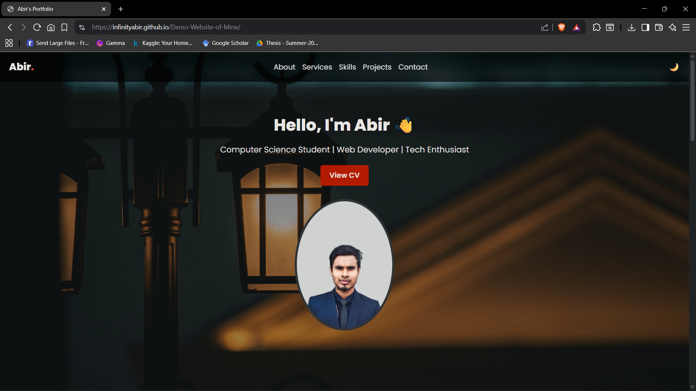

# Demo Website of Mine

Welcome to **Demo Website of Mine**, a personal portfolio single-page website built using **HTML**, **CSS**, and **Bootstrap 5**. It showcases my academic background, skills, experiences, and contact information—perfectly responsive and crafted for clarity.

##  Built With
- **HTML** – structure and content
- **CSS** – styling and responsiveness
- **Bootstrap 5** – grid layout and components

##  Live Demo
You can explore the live version here:  
https://infinityabir.github.io/Demo-Website-of-Mine/

---
### Screenshot:
### Homme Page


---
##  Overview

This site features:

- **Home**: A brief introduction—Hi, I'm Abir Hasan, a BCSE student with a strong academic standing and a passion for mentorship.
- **Services**:  
  - Mentoring in C programming  
  - Academic project leadership  
  - Basic web development  
  - Cybersecurity practices & image forensics
- **Skills**:  
  - Programming: C, C++, Python, C#, R  
  - Web: HTML  
  - Database: SQL  
  - Cybersecurity: Ethical Hacking, Image Forensics  
  - Tools: GitHub, Visual Studio, Kali Linux
- **Education**:  
  - Bachelor of CSE, IUBAT (2022–2026) – CGPA: 3.67/4.00  
  - HSC, Gaibandha Adarsha College (2020–2021) – GPA: 5.00  
  - SSC, Govt. Boys' High School, Gaibandha (2018–2019) – GPA: 5.00
- **Experience**:  
  - Mentor – Programming with C at IUBAT (2023): Guided junior students through fundamentals and problem-solving.
- **Contact**:  
  - Email 
  - Phone
  - Location

---
##  Getting Started

### To View Locally:
1. **Clone the repo**  
   ```bash
   git clone https://github.com/InfinityAbir/Demo-Website-of-Mine.git
---
##  License

Distributed under the **MIT License**. See [LICENSE](LICENSE) for details.  
© 2025 Abir Hasan.

## 👨‍💻 Author

Developed by **Abir Hasan**  
© 2025 All Rights Reserved  

⭐ If you like this project, feel free to fork, star, or suggest improvements!
